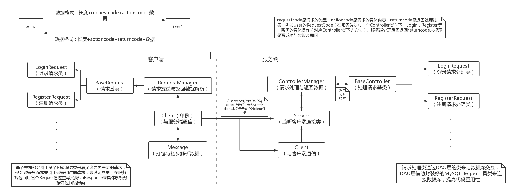
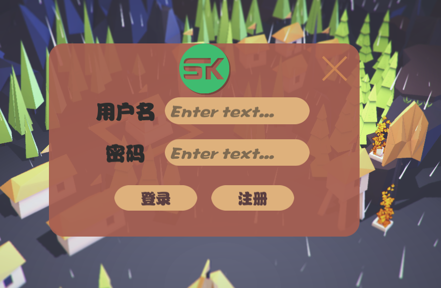
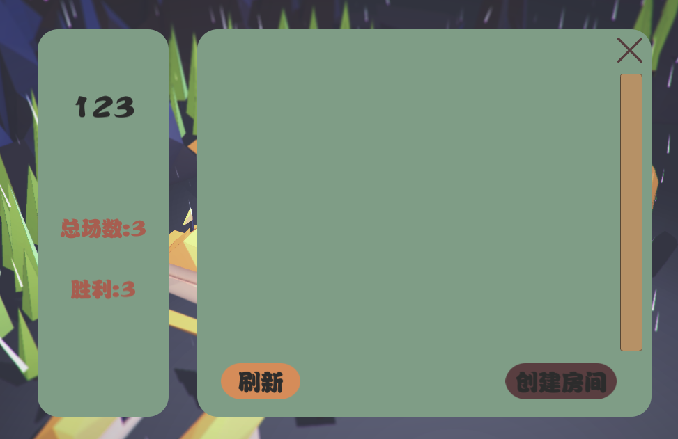
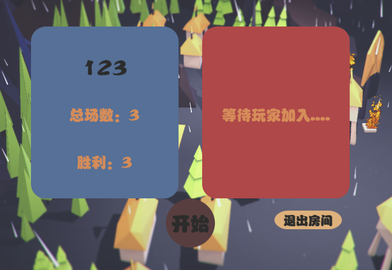
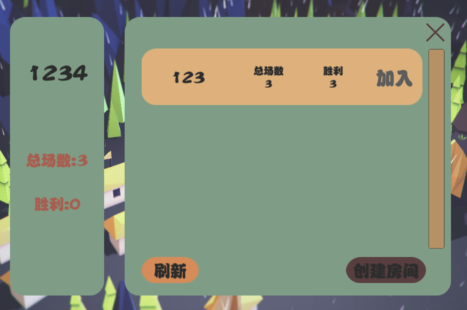
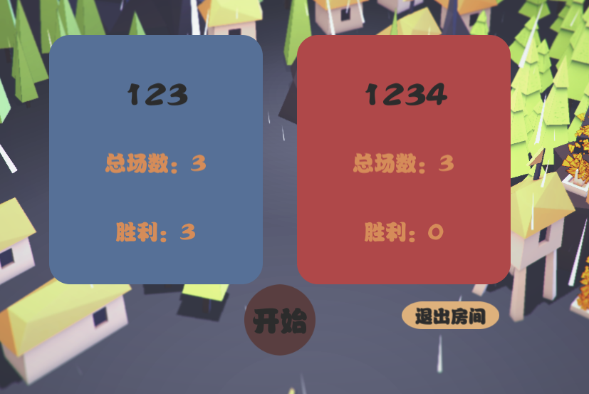

# 丛林战争
**作者：积极向上小木木 &nbsp;&nbsp;&nbsp;&nbsp;&nbsp;&nbsp;&nbsp; 联系方式：PositiveMumu@126.com**

*小型网络对战游戏。游戏分为客户端和服务端*

## 一、项目介绍

### 1.丛林战争服务器项目
1. 文件夹名为丛林战争，请使用Rider或Visual Studio打开。
2. 其中分为一个丛林战争服务器端和一个共享项目。
	- 丛林战争服务器端是主项目，采用C#控制台应用开发，我们运行与发布的就是这个项目。
	- 共享项目本质是个类库项目，将一些客户端与服务端需要共同的类在此建立并修改，然后发布并导入客户端中。

### 2.丛林战争客户端项目
1. 文件夹名为JungleWarClient，请使用Unity打开。
2. 主要功能：
	- 注册。
	- 登录。
	- 创建房间。
	- 刷新房间。
	- 显示战绩。
	- 在线对战。

## 二、网络通信框架

## 三、项目信息
1. 丛林战争服务端使用Rider_2018.3.5（VS_2017）开发。
2. 丛林战争客户端使用Unity_2018.4.0f1开发。
3. 在客户端开发中笔者使用了自己封装的UGUI管理插件——UIFrameWork。
4. 数据库使用mysql_5.7。

## 四、还原步骤
### 1.数据库
- 通过工具还原至数据库中。

### 2.服务端

1. 使用Rider（VS）打开项目。
2. 修改"丛林战争/丛林战争服务端/Config/ServerConfig.xml”中的选项：

- 将其中Sources标签中的链接字符串换为自己的连接字符串。
- 将其中的IPAddress标签换为自己的IP地址。
- 将其中的IPPort标签换为自己的端口。

3. 运行"丛林战争/丛林战争服务端/Program.cs"文件。

### 3.客户端
1. 使用Unity打开项目。
2. 修改”JungleWarClient/Assets/Scripts/Game/Config.cs“中的选项。
	- serverIP修改为服务端中的IP地址。
	- serverPort修改为服务端中的端口号
3.  在Unity中运行项目。

## 五、项目运行注意事项
1. 用户创建房间后，其他客户的需要刷新才能看见房间。
2. 笔者提供了两个账号，供测试使用：
	- 账号：admin  密码：admin
	- 账号：vili  密码：vili
3. 可以自己注册新的账号。
4. 测试时需要运行两个客户端。所以可以将项目打包成你对应平台的包，再运行测试。
5. 只有房主能开始游戏。默认创建房间的人为房主，即蓝色方。加入者为红色方。

## 六、项目截图
1. 初始页面：

	
	
2. 登录：

	
	
3. 注册：

	
	
4. 房间列表：

	
	
5. 创建房间：

	
	
6. 刷新房间列表：

	
	
7. 加入房间：

	
	
8. 蓝色方视角：

	
	
9. 红色方视角：

	
